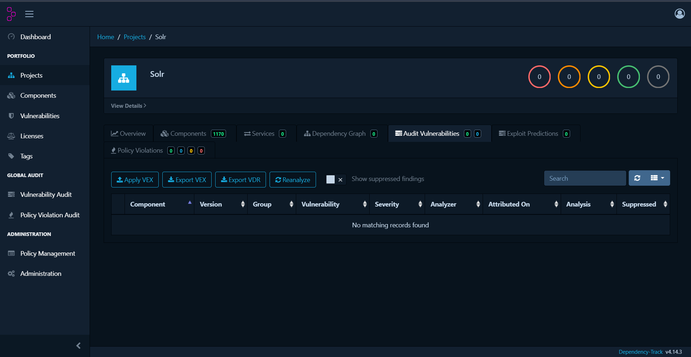

# SecureSolr — Hardened Apache Solr with Apache Ranger

SecureSolr is a Dockerized Apache Solr security demonstration integrating **Apache Solr 8.11.2** with **Apache Ranger 2.8.0** for centralized authorization, policy enforcement, and audit logging.

The project also includes a **React + Vite security dashboard** for monitoring SolrCloud, collections, Ranger policies, users, permissions, and authorization audit events.

The repository includes architecture documentation, end-to-end security validation evidence, vulnerability scan results, sample data, and Software Bill of Materials (SBOM) files.

---

## Features

### Solr Security

- Apache Solr 8.11.2
- SolrCloud mode
- ZooKeeper integration
- Solr Basic Authentication
- Apache Ranger 2.8.0 authorization plugin
- Ranger policy-based access control
- Ranger audit logging
- Custom hardened Docker image
- Persistent Solr data support

### Security Hardening

- Hardened Solr container configuration
- Dependency/JAR hardening support
- CycloneDX SBOM
- SPDX SBOM
- Grype vulnerability scanning
- Example security configuration without production credentials
- Secrets and local security configuration excluded from Git
- Sanitized authorization and audit evidence

### SecureSolr Dashboard

React + Vite frontend providing:

- Security Dashboard
- Collections monitoring
- SolrCloud cluster monitoring
- Apache Ranger policy viewer
- Ranger audit log viewer
- User and permission overview
- Allowed/Denied authorization statistics
- Audit search and filtering
- Live data retrieved from Solr and Ranger APIs

---

## Architecture

```text
                    SecureSolr React Frontend
                              |
                +-------------+-------------+
                |                           |
                v                           v
        Hardened Apache Solr          Apache Ranger Admin
            8.11.2                        2.8.0
                |                           |
                | Ranger Solr Plugin       | Policies
                +-------------+-------------+
                              |
                       Authorization
                              |
                    +---------+---------+
                    |                   |
                 ALLOW                DENY
                    |                   |
                    +---------+---------+
                              |
                        Ranger Audit
                              |
                    Ranger Audit Solr
```

Authentication is performed by **Solr BasicAuth**.

Authorization decisions are performed by the **Apache Ranger Solr plugin**.

Authorization events are written to **Ranger Audit Solr** and displayed by the SecureSolr frontend.

For a more detailed description of the architecture and security flow, see:

```text
docs/architecture.md
```

---

## Security Flow

The SecureSolr security path is:

```text
User Request
     |
     v
Solr BasicAuth
     |
     v
Authentication
     |
     v
Apache Ranger Solr Plugin
     |
     v
Ranger Policy Evaluation
     |
 +---+---+
 |       |
 v       v
ALLOW   DENY
 |       |
 +---+---+
     |
     v
Ranger Audit
     |
     v
SecureSolr Dashboard
```

This separates authentication from authorization:

- **Solr BasicAuth** verifies the identity of the user.
- **Apache Ranger** determines what the authenticated user is permitted to do.
- **Ranger Audit** records authorization decisions.
- **SecureSolr Dashboard** provides visibility into the resulting security events.

---

## Tested Authorization Flow

The demonstration includes a Ranger collection policy where:

- `admin` has query and update permissions.
- `testuser` has query permission.
- `testuser` does not have update permission.

The integration was tested end-to-end.

### Allowed Request

```text
User: testuser
Resource: testcollection
Action: query
Ranger Policy: 4
Result: ALLOWED
```

### Denied Request

```text
User: testuser
Resource: testcollection
Action: update
Ranger Policy: none
Result: DENIED (HTTP 403)
```

Both authorization decisions are recorded by Ranger Audit and displayed in the SecureSolr Audit Logs page.

Detailed validation documentation is available in:

```text
docs/validation.md
```

---

## Project Structure

```text
.
├── Dockerfile
├── harden-jars.sh
├── log4j2.xml
├── security.example.json
├── solr-entrypoint.sh
├── solr.xml
├── start-services.sh
│
├── data/
│   ├── README.md
│   └── sample-data.json
│
├── docs/
│   ├── architecture.md
│   └── validation.md
│
├── logs/
│   ├── README.md
│   ├── authorization-validation.txt
│   ├── grype-high-critical.txt
│   └── ranger-audit-sample.json
│
├── sbom/
│   ├── README.md
│   ├── sbom.cdx.json
│   └── sbom.spdx.json
│
└── frontend/
    ├── src/
    │   ├── components/
    │   ├── pages/
    │   │   ├── Dashboard.jsx
    │   │   ├── Collections.jsx
    │   │   ├── Cluster.jsx
    │   │   ├── RangerPolicies.jsx
    │   │   ├── AuditLogs.jsx
    │   │   └── Users.jsx
    │   └── services/
    │       ├── solrApi.js
    │       ├── rangerApi.js
    │       └── auditApi.js
    ├── package.json
    └── vite.config.js
```

---

## Documentation and Validation Evidence

The repository contains supporting documentation and sanitized security validation evidence.

### Architecture Documentation

```text
docs/architecture.md
```

Contains a detailed description of the SecureSolr architecture, including:

- SolrCloud
- Solr BasicAuth
- Apache Ranger
- Ranger policy enforcement
- Ranger auditing
- SecureSolr frontend integration

### Validation Documentation

```text
docs/validation.md
```

Documents end-to-end validation of:

- Authentication
- Allowed authorization
- Denied authorization
- Ranger policy enforcement
- Ranger audit generation
- Frontend integration
- Security artifact validation

### Authorization Validation

```text
logs/authorization-validation.txt
```

Contains the results of the authorization tests performed against the Solr and Apache Ranger environment.

### Ranger Audit Sample

```text
logs/ranger-audit-sample.json
```

Contains a sanitized representation of Ranger authorization audit events.

Raw credentials, authentication headers, password hashes, API tokens, private keys, and other secrets are intentionally excluded.

### Vulnerability Scan

```text
logs/grype-high-critical.txt
```

Contains selected vulnerability findings generated using **Grype** for security analysis of the project dependencies/container environment.

These findings are retained as security assessment evidence and should not be interpreted as a claim that the Solr 8.11.2 dependency stack is vulnerability-free.

### Sample Data

```text
data/sample-data.json
```

Contains non-sensitive sample data that can be used for demonstration and validation.

---

## Prerequisites

The following tools are required:

- Docker
- Node.js
- npm

The full security demonstration also requires an **Apache Ranger 2.8.0** environment containing:

- Ranger Admin
- Ranger database
- Ranger ZooKeeper
- Ranger Audit Solr

The development environment for this project uses locally built patched Apache Ranger 2.8.0 images.

Sanitized Docker build definitions for the Ranger components are included under `ranger-build/`. Third-party JAR files, JDK archives, and other binary build artifacts are intentionally excluded from Git.

Therefore, rebuilding the patched Ranger images from a fresh clone currently requires supplying the dependency artifacts referenced by the corresponding Dockerfiles. See `ranger-build/README.md` for details.

The complete SecureSolr and Ranger service topology is defined in `docker-compose.yml`.

---

## Build the Hardened Solr Image

From the repository root:

```bash
docker build -t solr-hardened:8.11.2 .
```

---

## Security Configuration

Copy the example configuration before running the Solr container:

```bash
cp security.example.json security.json
```

Configure the required Solr users locally.

Do **not** commit:

```text
security.json
.env
.env.*
password files
API tokens
private keys
```

The repository `.gitignore` excludes local security configuration and other generated/private artifacts.

---

## Frontend Setup

Navigate to the frontend:

```bash
cd frontend
```

Install dependencies:

```bash
npm install
```

Start the development server:

```bash
npm run dev
```

Vite will display the local URL for the SecureSolr dashboard.

---

## Frontend API Configuration

During development, the Vite server proxies requests to the local Solr and Ranger services.

Credentials should be supplied through environment variables rather than hardcoded into frontend source files.

Example environment variables:

```text
SOLR_USER=<solr-admin-user>
SOLR_PASSWORD=<solr-admin-password>

RANGER_USER=<ranger-admin-user>
RANGER_PASSWORD=<ranger-admin-password>
```

Do not commit the real `.env` file.

---

## Dashboard Pages

### Dashboard

Displays:

- SolrCloud health
- Live nodes
- Collections
- Ranger status
- Ranger policy version
- Recent authorization activity

### Collections

Displays live Solr collection information including:

- Collection name
- Document count
- Shards
- Replication factor
- ConfigSet
- Replica state
- Leader information
- Collection health

### Cluster

Displays:

- Live Solr nodes
- Cluster health
- Shards
- Replicas
- Leaders
- Core information

### Ranger Policies

Retrieves Ranger policies from the Ranger Admin REST API and displays:

- Policy name
- Resource type
- Resource
- Users
- Allowed actions
- Policy status

### Audit Logs

Retrieves Ranger authorization events and displays:

- User
- Resource
- Action
- Policy
- Result
- Client IP
- Timestamp
- Allowed/Denied statistics

### Users

Builds a permission overview from Ranger policies showing which resources and actions are available to each user.

---

## Production Frontend Build

Create an optimized frontend build with:

```bash
cd frontend
npm run build
```

The production assets are generated under:

```text
frontend/dist/
```

The generated `dist/` directory should not be committed unless it is intentionally required for deployment.

---

## Software Bill of Materials (SBOM)

The repository includes Software Bill of Materials files in two formats.

### CycloneDX

```text
sbom/sbom.cdx.json
```

### SPDX

```text
sbom/sbom.spdx.json
```

Additional SBOM information is available in:

```text
sbom/README.md
```

The SBOM files provide an inventory of software components and dependencies and can be used with vulnerability-management and software supply-chain security tools such as Dependency-Track.

---

## Vulnerability Assessment

Security assessment artifacts are maintained separately from runtime configuration.

The repository contains a sanitized Grype report:

```text
logs/grype-high-critical.txt
```

The report documents identified dependency vulnerabilities and provides evidence of vulnerability analysis performed against the environment.

SecureSolr uses Apache Solr 8.11.2 as the target version for this security demonstration. Because this is an older Solr dependency stack, the repository does **not** claim that all upstream vulnerabilities have been eliminated.

Instead, the project demonstrates security controls and assessment practices including:

- Container hardening
- Dependency/JAR analysis
- Vulnerability scanning
- SBOM generation
- Authentication
- Centralized authorization
- Policy enforcement
- Security auditing
- Secret exclusion from source control

---

## Security Notes

This repository intentionally does not contain plaintext production credentials.

Never commit:

- `security.json`
- `.env`
- `.env.*`
- Password files
- API tokens
- Private keys
- Authentication headers
- Raw production audit data containing sensitive information

Use example configuration files, environment variables, secret-management mechanisms, and sanitized evidence when sharing or deploying the project.

---

## Demonstration

A typical SecureSolr security demonstration is:

1. Start the Ranger infrastructure.
2. Start the hardened Solr container.
3. Start the SecureSolr React frontend.
4. Open Ranger Policies and verify the collection policy.
5. Query `testcollection` as `testuser`.
6. Ranger allows the query.
7. Attempt an update as `testuser`.
8. Ranger denies the update with HTTP `403`.
9. Open Audit Logs.
10. Verify both `ALLOWED` and `DENIED` authorization events.

This demonstrates the complete security path:

```text
Authentication
      ↓
Solr BasicAuth
      ↓
Apache Ranger
      ↓
Policy Enforcement
      ↓
ALLOW / DENY
      ↓
Ranger Audit
      ↓
SecureSolr Dashboard
```

---

## Validation Summary

The SecureSolr environment has been used to validate the following security behavior:

| Validation | Expected Result |
|---|---|
| Solr authentication | Authenticated users can access permitted Solr resources |
| Ranger integration | Solr authorization requests reach Ranger |
| Allowed query | `testuser` query is allowed |
| Denied update | `testuser` update is rejected with HTTP 403 |
| Ranger auditing | Authorization events are recorded |
| Audit visibility | ALLOWED and DENIED events are visible through the dashboard |
| SBOM generation | CycloneDX and SPDX SBOMs are available |
| Vulnerability assessment | Grype findings are retained as security evidence |
| Secret protection | Production credentials are excluded from the repository |

Detailed validation evidence is available under:

```text
docs/
logs/
sbom/
```

---

## Current Limitation

The repository includes sanitized Docker build definitions for the patched **Apache Ranger 2.8.0** components under `ranger-build/`.

Third-party binary dependencies used by these builds, including JAR files and JDK archives, are intentionally excluded from Git. As a result, the Ranger images are not currently zero-preparation builds from a fresh clone. The required artifacts must be supplied to the appropriate build contexts before rebuilding the patched images.

Alternatively, an existing compatible Apache Ranger 2.8.0 environment can be used for the complete SecureSolr Ranger integration demonstration.

---

## Working Demo & Authorization Validation

The SecureSolr environment was functionally validated using the running Apache SolrCloud and Apache Ranger services. The following screenshots demonstrate system monitoring, Ranger policy configuration, role-based authorization, and audit logging.

### SecureSolr Security Dashboard

The SecureSolr dashboard provides a centralized view of the SolrCloud environment and its security configuration.


### Solr Collection Overview

The collection view displays the configured Solr collection and its operational information.


### SolrCloud Cluster Status

The cluster view provides visibility into the running SolrCloud environment and cluster status.


### Apache Ranger Authorization Policies

Apache Ranger policies define the permissions assigned to users for protected Solr resources.


### Apache Ranger Audit Log

Ranger audit records provide traceability of authorization decisions, including allowed and denied operations.


### Ranger User Permission Matrix

The permission matrix provides a consolidated view of the access privileges assigned to the configured users.


### Authorization Test Results

Role-based access control was validated using administrator and restricted test-user accounts.

| User | Query | Update |
| --- | --- | --- |
| Admin | Allowed (HTTP 200) | Allowed (HTTP 200) |
| Test User | Allowed (HTTP 200) | Denied (HTTP 403) |

The test-user validation demonstrates that an authorized query succeeds while an unauthorized update is rejected by the Ranger authorization policy.


The administrator validation demonstrates successful execution of an authorized update operation.

.png)

These results demonstrate that the SecureSolr environment enforces the configured Apache Ranger authorization policies and records security-relevant access events for auditing.


## Dependency-Track Validation

The SecureSolr SBOM was analyzed using OWASP Dependency-Track v4.14.3 for software composition analysis.

The analyzed Solr project contained **1,170 components**. At the time of validation, Dependency-Track reported:

- Critical vulnerabilities: **0**
- High vulnerabilities: **0**
- Medium vulnerabilities: **0**
- Low vulnerabilities: **0**
- Policy violations: **0**

The Dependency-Track vulnerability audit displayed no vulnerability findings for the analyzed SBOM.



Detailed validation evidence is available in:

`logs/dependency-track-validation.md`

> **Note:** Dependency-Track and Grype may produce different vulnerability results because they can use different vulnerability data sources and component-matching methods. The Dependency-Track results above represent this specific SBOM analysis and should not be interpreted as a general claim that SecureSolr contains no vulnerabilities.

## Security Disclaimer

SecureSolr is a security demonstration and validation environment.

The included example configuration, sample data, validation logs, audit samples, and security artifacts are intended for development, testing, and demonstration purposes.

Production deployments should use organization-approved secret management, TLS configuration, access controls, network isolation, vulnerability-management processes, supported software versions, and operational security controls.